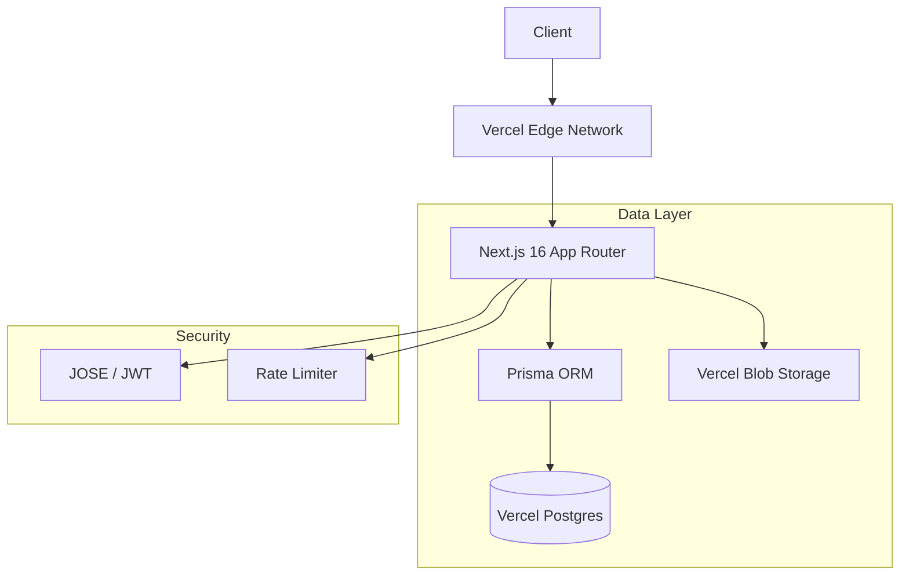

```text
 __      __  _       _              _   
 \ \    / / (_)     | |            | |  
  \ \  / /   _   ___| |__    __ _  | |  
   \ \/ /   | | / __| '_ \  / _` | | |  
    \  /    | | \__ \ | | | | (_| | | | 
     \/     |_| |___/_| |_|  \__,_| |_| 
                                        
 P A I N J A N E  .  D E V  
```


## System Overview

This repository contains the source code for a comprehensive personal digital garden and portfolio. Built on a modern full-stack architecture, it serves as a platform for technical writing, weekly reflections, project showcases, and a curated reading list. The system features a secure, custom-built administration dashboard for content management, eliminating the need for headless CMS dependencies.

### Key Capabilities

*   **Dynamic Content Management:** Full CRUD capabilities for Blogs, Projects, and Reflections via a secured admin interface.
*   **Markdown Engineering:** Custom Markdown rendering engine with support for syntax highlighting and mathematical notation (KaTeX).
*   **Secure Authentication:** JOSE-based JWT implementation with stateless session management and rate limiting.
*   **Performance:** Heavily optimized with Next.js partial prerendering, unstable_cache for database queries, and aggressive image optimization.

---

## Technical Architecture

The application is engineered using a robust, type-safe stack designed for scalability and maintainability.



### Core Stack

| Component | Technology | Description |
|-----------|------------|-------------|
| **Framework** | Next.js 16.1 | App Router, Server Actions, React 19 RC |
| **Language** | TypeScript | Strict type safety across full stack |
| **Styling** | Tailwind CSS v4 | Utility-first styling with custom design tokens |
| **Database** | PostgreSQL | Managed via Vercel Postgres |
| **ORM** | Prisma | Schema-driven data modeling and migrations |
| **Storage** | Vercel Blob | Object storage for media assets |
| **Auth** | JOSE | Lightweight JWT signing and verification |
| **Animation** | Framer Motion | Gestures and layout transitions |

---

## Directory Structure

```text
src/
├── app/                 # App Router routes and page logic
│   ├── api/             # RESTful API endpoints (Admin secured)
│   ├── admin/           # Protected administration dashboard
│   ├── blog/            # Public blog rendering
│   └── ...
├── components/          # Reusable UI components
│   ├── admin/           # Dashboard specific widgets
│   └── ui/              # Design system primitives
├── lib/                 # Shared utilities
│   ├── auth.ts          # JWT and Session logic
│   ├── db.ts            # Prisma client singleton
│   └── cached-data.ts   # Data fetching with revalidation strategies
├── config/              # Site-wide configuration constants
└── prisma/              # Database schema and migrations
```

---

## Getting Started

### Prerequisites

*   Node.js 18+
*   npm or pnpm
*   PostgreSQL Database (Local or Vercel Postgres)

### Installation

1.  **Clone the repository**
    ```bash
    git clone https://github.com/Vishal_Painjane/Vishal_Painjane.git
    cd Vishal_Painjane
    ```

2.  **Install dependencies**
    ```bash
    npm install
    ```

3.  **Environment Configuration**
    Create a `.env` file in the root directory. Required variables:

    ```bash
    # Database
    POSTGRES_URL="postgres://..."
    POSTGRES_PRISMA_URL="postgres://..."
    POSTGRES_URL_NON_POOLING="postgres://..."

    # Security
    JWT_SECRET="<32-byte-random-string>"
    ADMIN_PASSWORD="<your-secure-password>"
    
    # Storage
    BLOB_READ_WRITE_TOKEN="vercel_blob_rw_..."
    ```

4.  **Database Setup**
    Initialize the Prisma client and push the schema to your database.
    ```bash
    npx prisma generate
    npx prisma db push
    ```

5.  **Development Server**
    ```bash
    npm run dev
    ```

---

## Administration

The application includes a hidden `/admin` route. Access is protected by a custom authentication gate.

*   **Authentication:** Password-based entry (defined in env).
*   **Session:** HTTP-only cookies with strict SameSite policy.
*   **Features:**
    *   **Blog Editor:** WYSIWYG Markdown editor with live preview and split view.
    *   **Media:** Direct drag-and-drop upload to Vercel Blob.
    *   **Metrics:** Basic content statistics.

---

## Deployment

This project is optimized for deployment on **Vercel**.

1.  Connect the repository to Vercel.
2.  Configure the `root directory` (Project is in the root).
3.  Add the Environment Variables in the project settings.
4.  Deploy.

**Build Command:**
```bash
prisma generate && prisma db push --accept-data-loss && next build
```

---

## License

Copyright (c) 2026 Vishal Painjane.
This project is licensed under the MIT License.